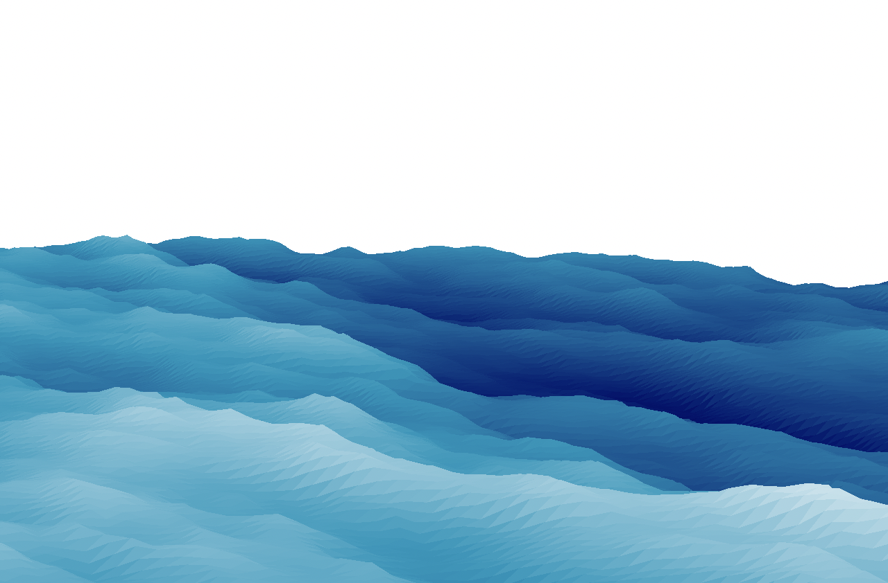

# FFTOcean
Ocean simulation in Python.

## Requirements
`
python>=3.10
torch
numpy
matplotlib
`

## Preview Simulation

Running `main.py` starts a preview simulation. The parameters for the preview simulation can be changed in `main.py`.

## Simulation Setup

To setup a simulation, import `Ocean` from `fftocean/ocean.py`. The simulation supports any number of cascades, each with individual simulation settings. When providing settings to individual cascades, do so in a `tuple` where the $i$-th setting corresponds to the $i$-th cascade. The number of settings must be equal to the number of cascades.

Alternatively, when a setting is shared across all cascades it can simply be provided as a single number. For an example simulation setup, see `main.py`.

## Simulation Settings

The simulation can be customized with a variety of settings.

- `num_cascades`: The number of cascades used in the simutation.
- `resolution`: The resolution of the simulation. **This setting cannot be initialized individually for each cascade.**
- `cascade_size`: Size of cascade. This determines the scale of the simulation for the given cascade.
- `cascade_strength`: Multiplier that determines how much each cascade contributes to the simulation.
- `wind_speed`: Speed of simulated wind.
- `wind_angle`: Angle of the wind direction. An angle of $0$ degrees results coming from an eastwards direction, $90$ degree northwards, etc.
- `swell`: Determines how much the waves align perpendicular to the wind direction.
- `choppiness`: Determines the choppiness or amplitude of the waves.
- `simulation_speed`: Determines the speed of the simulation. Simulation speed is independent from framerate.
- `cascade_time_multiplier`: Multiplier for the simulation speed per cascade, to tweak simulation speed for each cascade individually.
- `angle_unit`: Whether the `wind_angle` is provided as degrees (`"deg"`) or radians (`"rad"`). Defaults to degrees.

## Running the Simulation

Once the `Ocean` object has been initialized, the simulation can be started by calling the `run()` method. This method has a single argument, `render_resolution`, that determines the resolution of the rendered ocean mesh. Defaults to $50$, rendering a mesh of $50 \times 50$ vertices. This setting **significantly** impacts performance. 
